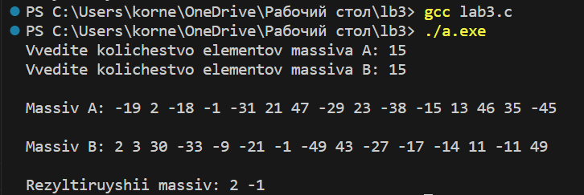

#  Лабораторная работа №3.
## Массивы и функции.
### Задание.
#### Вариант 4.
Максимально эффективно по используемой памяти сформировать массив из элементов, встречающихся в обоих массивах A и B.
### Программное решение.

```c
#include <stdio.h>
#include <stdlib.h>
#include <time.h>

void fill(int a[], int size) 
{
    for (int i = 0; i < size; i++) 
    {
        a[i] = rand() % 101 - 50;
    }
}

void print(int a[], int size) 
{
    for (int i = 0; i < size; i++) 
    {
        printf("%d ", a[i]);
    }
    printf("\n");
}

int* Elements(int a[], int size1, int b[], int size2, int* newSize) 
{
    int max_size = size1 < size2 ? size1 : size2; // размер результирующего массива не превышает размера наименьшего массива
    int* result = (int*)malloc(max_size * sizeof(int));

    int index = 0;
    for (int i = 0; i < size1; i++) 
    {
        for (int j = 0; j < size2; j++) 
        {
            if (a[i] == b[j]) 
            {
                result[index++] = a[i];
                break;
            }
        }
    }

    *newSize = index; // сохраняем новый размер массива
    result = (int*)realloc(result, index * sizeof(int)); // перевыделяем память под массив

    return result;
}

int main() 
{
    srand(time(NULL));

    int size1, size2;
    printf("Vvedite kolichestvo elementov massiva A: ");
    scanf("%d", &size1);
    printf("Vvedite kolichestvo elementov massiva B: ");
    scanf("%d", &size2);

    int* a = (int*)malloc(size1 * sizeof(int));
    int* b = (int*)malloc(size2 * sizeof(int));

    fill(a, size1);
    printf("\nMassiv A: ");
    print(a, size1);

    fill(b, size2);
    printf("\nMassiv B: ");
    print(b, size2);

    int newSize;
    int* commonElements = Elements(a, size1, b, size2, &newSize);
    printf("\nRezyltiruyshii massiv: ");
    print(commonElements, newSize);

    free(a);
    free(b);
    free(commonElements);

    return 0;
}
 ```

 ### Результат программы.

